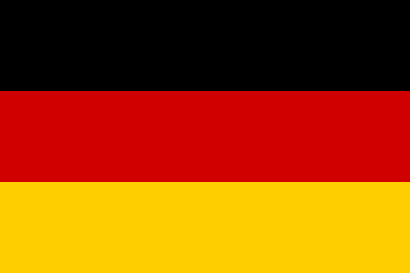

# Python Fractal Tree

This is a project where we use a Python library called processing which we haven't used before in our projects. This is a library of graphics functions which allows many of the same processes as the turtle library but has many more possibilities. One of these is the ability to edit graphics images, like digital photos, and even create images. This project is about using Python code to create an image file.

Here is a png file of the flag of Germany generated by the processing library.

  

---
## Link to video summary of the online session

### Videos for Flags session - Saturday 7 May 2022

[https://youtu.be/537xzZdFwNo](https://youtu.be/537xzZdFwNo)

You can find more information about this session in the Information box under the video on Youtube.

At the end of the video we set some challenges to test your Python coding skills. The following video will not give you the answers to the challenges but will give you hints that will hopefully let you work out solutions for yourself.

[https://youtu.be/s1MREelKiC4](https://youtu.be/s1MREelKiC4)

---
There is no starter trinket for the Flags project, but if you want to see what the code looked like at the end of the first video go to:

[https://trinket.io/python/e1aa6a8357](https://trinket.io/python/e1aa6a8357)

---
[Back to index](README.md)
