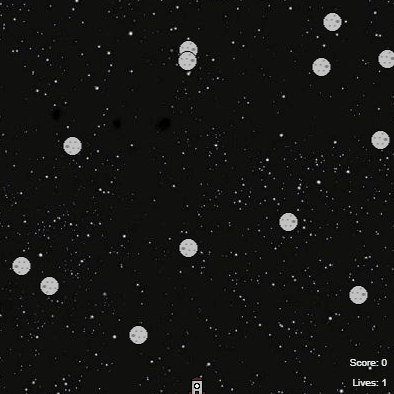

# Space Race for Python

This is a Python game where the player controls a rocket (actually a turtle object) which has to get from the bottom of the screen to the top without being hit by asteroids, which come across the screen from the left and from the right.

This game teaches some fundamental Python concepts and some elements of games development. By the end of the project, you will have created the rocket, the asteroids, the collision logic and the surrounding game play.

We did this project across two sessions in November 2020.

The instructions for building the game can be found [here](https://github.com/WokLibCodeClub/SpaceRace).

The starter code for the game is here: https://trinket.io/python/2a47e8809a

