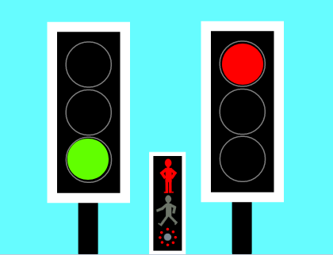

# Traffic Lights for Scratch

We use the Scratch system of broadcasting messages to control the lights on two sets of traffic lights, which control the traffic in two directions at a crossroads. When one set of lights shows green what colour should the other show?

We first have to build the correct sequence of lights for one set of traffic lights, then add the controls for the second set, so that the traffic is safely controlled in both directions.

Finally we add the code for a Puffin crossing to allow pedestrians to cross when all the traffic is stopped.

Here is the link to the Scratch starter project:

[https://scratch.mit.edu/projects/444744604](https://scratch.mit.edu/projects/444744604)

### <ins>Links to summaries of the online sessions:</ins>

Video summary of first session, 7 November 2020:  [https://youtu.be/O_gISaiaM9A](https://youtu.be/O_gISaiaM9A)

pdf document with summary of code for first session:  [Traffic Light Code #1](https://github.com/WokLibCodeClub/OnlineCodeclub/blob/master/CodeClub_Scratch_Traffic_Light_Code_%231.pdf)

Video summary of second session, 14 November 2020:  [https://youtu.be/-PU2A6Q7RiY](https://youtu.be/-PU2A6Q7RiY)

[Back to index](README.md)
