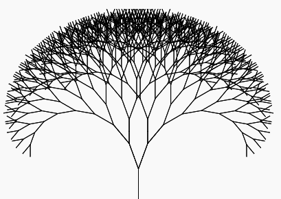

# Python Fractal Tree

This is project where we use a Python turtle to draw a complicated tree using just a few lines of code and a type of Python function which calls itself. An example of the sort of pattern we can make is shown here:

  

## Link to video summary of the online session

### Video for fractal tree session - Saturday 5 February 2022

[https://youtu.be/xIYT7vukGd8](https://youtu.be/xIYT7vukGd8)

You can find more information about this session in the Information box under the video on Youtube.

There is no starter trinket for this project, but if you want to see what the code looked like at the end of the video go to:

[https://trinket.io/python/1effec4d16](https://trinket.io/python/1effec4d16)

There is a pdf document showing a walk through of the code for a very simple version of the tree pattern. You can see it here:

[Fractal_tree_walkthrough.pdf](Fractal_tree_walkthrough.pdf)

It is best to view this document one whole page at a time without any scrolling between pages, so you will probably need to download it to your computer.

If you are viewing it in Microsoft Edge (which is the default for Windows 10) then navigate through the pages using the RIGHT and LEFT ARROW keys - this will jump to the next page without scrolling.

[Back to index](README.md)
